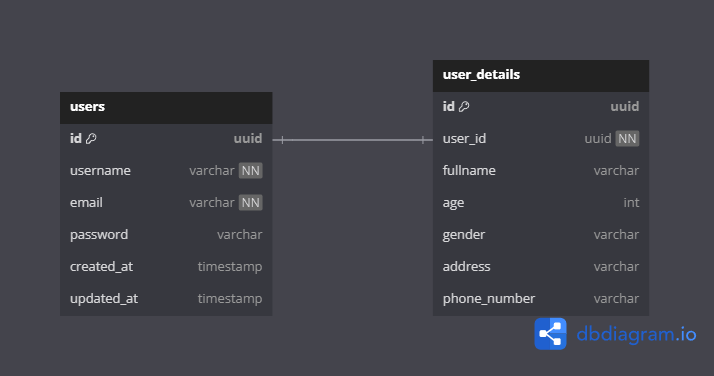

# be-player-performance-app
by. Imam Rafiif Arrazaan
## Content
- [Getting started](#getting-started)
- [Features](#features)
    - [Login With Google](#login-with-google)
    - [Identity](#identity)
    - [Calcute Performance](#calculate-performance)
- [Database Schema](#database-schema)
- [API Documentation](#api-documentation)
- [Batasan Masalah](#batasan-masalah)
## Getting Started
1. Make .env based on .env.example and populate the env variables.
2. Make sure the GOOGLE_OAUTH_CLIENT_ID and GOOGLE_OAUTH_CLIENT_SECRET is filled correctly. Here is some video that might help when setting the client_id and client_secret [link](https://www.youtube.com/watch?v=r5ff1_3WrPM&ab_channel=ADayWithDev).
3. Open the directory terminal and type
```sh
make compose-up
```
4. To end the program, open the directory terminal and type
```sh
make compose-down
```

## Features
### Login With Google
This feature enable user to login with their google account. The access token to use protected feature will be stored as a cookie.<br>
Use this feature using web browser (tested on Google Chrome)<br>
Steps:<br>
1. Open browser and enter url {{HOST}}/oauth/google
2. Sign in with your google account
3. You can enter other feature endpoint then <br>

If you want to use Postman/Insomnia etc. After browser shows Login Success message, inspect element, go to Application, select Cookies, click access_token Cookie, and you can get the access token there.

### Identity
This feature enable user to get the identity of the searched user by using their firstname as a keyword.<br>
Steps:<br>
1. Make sure to add access_token cookie before accessing this feature.
2. Enter endpoint {{HOST}}/api/identity?name={{keyword}}.
3. Fill the {{keyword}} with wanted identity firstname.

### Calculate Performance
This feature enable user to get Diki final proficiency level as int the task.<br>
Steps:<br>
1. Make sure to add access_token cookie before accessing this feature.
2. Enter endpoint {{HOST}}/api/identity?n={{var}}&m={{var}}&a={{var}}&b={{var}}.
3. Fill the {{var}}.

## Database Schema

<details>
  <summary>Click me</summary>


</details>

## API Documentation
After running the program, ypu can go to your browser and enter {{HOST}}/swagger/index.html. <br>
OR<br>
Open the directory terminal and type
```sh
swag init
```
Then open the swagger.yaml in docs directory in [Swagger Editor](https://editor.swagger.io/)<br>
swag use [swaggo/swag](https://github.com/swaggo/swag)

## Batasan Masalah
1. Access Token is stored as cookie and need to be used as cookie to use protected feature. Swagger 2.0 can not use cookie as a Header.
2. User login from browser with their google account.
3. Make sure DB env variables in .env file are synced with the env variables in the docker-compose.yml file.
4. Unit testing only be done for the services layer.